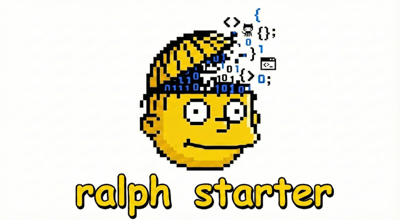

<p align="center">
  
</p>

<p align="center">
  <a href="https://www.npmjs.com/package/ralph-starter"></a>
  <a href="https://www.npmjs.com/package/ralph-starter"></a>
  <a href="https://github.com/rubenmarcus/ralph-starter/blob/main/LICENSE"></a>
  <a href="https://github.com/rubenmarcus/ralph-starter/actions"></a>
  <a href="https://github.com/rubenmarcus/ralph-starter"></a>
</p>

<h3 align="center">
  <strong>Connect your tools. Run AI coding loops. Ship faster.</strong>
</h3>

<p align="center">
  <em>Pull specs from GitHub, Linear, Notion, Figma, and more — then let AI build it autonomously.</em>
</p>

<p align="center">
  <a href="#integrations">Integrations</a> •
  <a href="#quick-start">Quick Start</a> •
  <a href="#features">Features</a> •
  <a href="https://ralphstarter.ai">Docs</a>
</p>

---


Most AI coding tools work in isolation. You describe a task, AI builds it, done.

**ralph-starter** is different. It **connects to your existing workflow** — pulling specs from GitHub issues, Linear tickets, Notion docs, or any URL — then runs autonomous AI loops until the task is complete.

```bash
# Build from a GitHub issue
ralph-starter run --from github --project myorg/myrepo --label "ready"

# Build from a Linear ticket
ralph-starter run --from linear --project "Mobile App" --label "sprint-1"

# Build from a Notion spec
ralph-starter run --from notion --project "https://notion.so/Product-Spec-abc123"

# Or just describe what you want
ralph-starter run "build a todo app with React" --commit
```

---

## Integrations

ralph-starter integrates with your favorite tools out of the box:

| Integration | Auth Method | What It Fetches |
|-------------|-------------|-----------------|
| **GitHub** | `gh` CLI (recommended) or API token | Issues, PRs, files |
| **Linear** | `linear` CLI or API key | Issues by team/project |
| **Notion** | None (public) or API token (private) | Pages, databases |
| **Figma** | API token | Design specs, tokens, assets & content extraction |
| **URLs** | None | Any public markdown/HTML |
| **Files** | None | Local markdown, PDF |

```bash
# Check available integrations
ralph-starter integrations list

# Test connectivity
ralph-starter integrations test github
ralph-starter integrations test linear

# Preview data before running
ralph-starter integrations fetch github owner/repo
```

> **Want more integrations?** PRs welcome! See [CONTRIBUTING.md](CONTRIBUTING.md) to get started.

---

## Table of Contents

- [Why ralph-starter?](#why-ralph-starter)
- [Integrations](#integrations)
- [Quick Start](#quick-start)
- [Features](#features)
- [Ralph Playbook Workflow](#ralph-playbook-workflow)
- [Commands](#commands)
- [Options](#options-for-run)
- [Configuration](#api-key-configuration)
- [Contributing](#contributing)

---

## Summary

**ralph-starter** is a production-ready CLI for running autonomous AI coding loops using the [Ralph Wiggum technique](https://ghuntley.com/ralph/). It makes autonomous coding accessible to everyone.

### Key Features

| Feature | Description |
|---------|-------------|
| **Integrations** | Pull specs from GitHub, Linear, Notion, Figma, URLs, files |
| **Multi-Agent Support** | Works with Claude Code, Cursor, Copilot, Gemini CLI, and more |
| **Interactive Wizard** | Guided project creation with AI-refined specifications |
| **16+ Workflow Presets** | Pre-configured modes: feature, tdd, debug, review, and more |
| **Circuit Breaker** | Auto-stops stuck loops after repeated failures |
| **Cost Tracking** | Estimates token usage and cost per iteration |
| **Git Automation** | Auto-commit, push, and PR creation |
| **Backpressure Validation** | Run tests/lint/build after each iteration |
| **MCP Server** | Use from Claude Desktop or any MCP client |

### Quick Example

```bash
# Simple task
ralph-starter run "build a todo app" --commit --validate

# With preset
ralph-starter run --preset tdd-red-green "add user authentication"

# With safety controls
ralph-starter run --rate-limit 50 --circuit-breaker-failures 3 "build X"

# Interactive wizard
ralph-starter
```

---

## What is Ralph Wiggum?

Ralph Wiggum is a technique for running AI coding agents in autonomous loops until tasks are completed. Instead of prompting back and forth, you give the AI a task and let it iterate until done.

**ralph-starter** makes this dead simple - for developers and non-developers alike.

## Installation

```bash
npm install -g ralph-starter
# or
npx ralph-starter
```

## Quick Start

### For Everyone (Non-Developers Welcome!)

Just run `ralph-starter` with no arguments to launch the interactive wizard:

```bash
ralph-starter
```

The wizard will:
1. Ask if you have a project idea (or help you brainstorm one)
2. Refine your idea with AI
3. Let you customize the tech stack
4. Build your project automatically

### Don't Know What to Build?

```bash
ralph-starter ideas
```

This launches **Idea Mode** - a brainstorming session to help you discover project ideas:
- **Brainstorm with AI** - Get creative suggestions
- **See trending ideas** - Based on 2025-2026 tech trends
- **Based on my skills** - Personalized to technologies you know
- **Solve a problem** - Help fix something that frustrates you

### For Developers

```bash
# Run a single task
ralph-starter run "build a todo app with React"

# With git automation
ralph-starter run "add user authentication" --commit --pr

# With validation (backpressure)
ralph-starter run "refactor auth" --commit --validate

# Fetch specs from external sources
ralph-starter run --from https://example.com/spec.md
ralph-starter run --from github --project myorg/myrepo --label "ready"
ralph-starter run --from linear --project "Mobile App"

# Fetch a specific GitHub issue
ralph-starter run --from github --project owner/repo --issue 123

# Specify output directory (skips "where to run?" prompt)
ralph-starter run --from github --project owner/repo --issue 42 --output-dir ~/projects/new-app
```

### Working with Existing Projects

ralph-starter automatically detects existing projects when you run the wizard:

**Ralph Playbook Project** (has AGENTS.md, IMPLEMENTATION_PLAN.md, etc.):
```bash
cd my-ralph-project
ralph-starter
```
The wizard will detect the Ralph Playbook files and let you:
- Continue working (run the build loop)
- Regenerate the implementation plan
- Add new specs

**Language Project** (has package.json, pyproject.toml, Cargo.toml, go.mod):
```bash
cd my-existing-app
ralph-starter
```
The wizard will detect the project type and let you:
- Add features to the existing project
- Create a new project in a subfolder

## Features

### Interactive Wizard
Launch with `ralph-starter` (no args) for a guided experience:
- Describe your idea in plain English
- AI refines and suggests features
- Choose your tech stack
- Auto-runs init → plan → build

### Idea Mode
For users who don't know what to build yet:
```bash
ralph-starter ideas
```

### Integrations & Input Sources

ralph-starter's superpower is **pulling specs from anywhere** — then building autonomously.

```bash
# From GitHub issues
ralph-starter run --from github --project owner/repo --label "ready"

# From Linear tickets
ralph-starter run --from linear --project "Mobile App"

# From Notion pages (public pages work without auth!)
ralph-starter run --from notion --project "https://notion.so/My-Spec-abc123"

# From URLs
ralph-starter run --from https://example.com/spec.md

# From local files
ralph-starter run --from ./specs/feature.md
```

#### Quick Setup

| Integration | Setup Command | Notes |
|-------------|---------------|-------|
| **GitHub** | `gh auth login` | Uses GitHub CLI (no API key needed) |
| **Linear** | `linear auth login` or `ralph-starter config set linear.apiKey <key>` | CLI or API key |
| **Notion** | None for public pages | Private pages need token |
| **Figma** | `ralph-starter config set figma.token <key>` | Get token from figma.com/developers |

#### Managing Integrations

```bash
# List all integrations with status
ralph-starter integrations list

# Test connectivity
ralph-starter integrations test github
ralph-starter integrations test linear

# Get help for specific integration
ralph-starter integrations help notion

# Preview data before running
ralph-starter integrations fetch github owner/repo --limit 5
```

> See the full [Integrations Guide](https://ralphstarter.ai/docs/integrations) for detailed setup instructions.

### MCP Server
Use ralph-starter from Claude Desktop or any MCP client:

```bash
ralph-starter mcp
```

Add to Claude Desktop config:
```json
{
  "mcpServers": {
    "ralph-starter": {
      "command": "ralph-starter",
      "args": ["mcp"]
    }
  }
}
```

**Available MCP Tools:**
- `ralph_init` - Initialize Ralph Playbook
- `ralph_plan` - Create implementation plan
- `ralph_run` - Execute coding loop
- `ralph_status` - Check progress
- `ralph_validate` - Run tests/lint/build

### Multi-Agent Support
Works with your favorite coding agents:
- **Claude Code** (recommended)
- **Cursor**
- **OpenCode**
- **OpenAI Codex**
- **GitHub Copilot**
- **Gemini CLI**
- **Amp**
- **Openclaw**

### LLM Providers
ralph-starter supports multiple LLM providers for internal features:

| Provider | Environment Variable | Description |
|----------|---------------------|-------------|
| **Anthropic** | `ANTHROPIC_API_KEY` | Claude models (default) |
| **OpenAI** | `OPENAI_API_KEY` | GPT-4 and GPT-4o |
| **OpenRouter** | `OPENROUTER_API_KEY` | 100+ models with one API |

These keys are for ralph-starter's internal LLM calls. Coding agents handle their own authentication.

### Git Automation
```bash
ralph-starter run "your task" --commit      # Auto-commit after tasks
ralph-starter run "your task" --push        # Push to remote
ralph-starter run "your task" --pr          # Create PR when done
```

### Backpressure Validation
```bash
ralph-starter run "your task" --validate    # Run tests/lint/build after each iteration
```

The `--validate` flag runs test, lint, and build commands (from AGENTS.md or package.json) after each iteration. If validation fails, the agent gets feedback to fix the issues.

### Workflow Presets

Pre-configured settings for common development scenarios:

```bash
# List all 16+ presets
ralph-starter presets

# Use a preset
ralph-starter run --preset feature "build login"
ralph-starter run --preset tdd-red-green "add tests"
ralph-starter run --preset debug "fix the bug"
ralph-starter run --preset refactor "clean up auth module"
ralph-starter run --preset pr-review "review changes"
```

**Available Presets:**
| Category | Presets |
|----------|---------|
| Development | `feature`, `feature-minimal`, `tdd-red-green`, `spec-driven`, `refactor` |
| Debugging | `debug`, `incident-response`, `code-archaeology` |
| Review | `review`, `pr-review`, `adversarial-review` |
| Documentation | `docs`, `documentation-first` |
| Specialized | `api-design`, `migration-safety`, `performance-optimization`, `scientific-method`, `research`, `gap-analysis` |

### Circuit Breaker

Automatically stops loops that are stuck:

```bash
# Stop after 3 consecutive failures (default)
ralph-starter run "build X" --validate

# Custom thresholds
ralph-starter run "build X" --circuit-breaker-failures 2 --circuit-breaker-errors 3
```

The circuit breaker monitors:
- **Consecutive failures**: Stops after N validation failures in a row
- **Same error count**: Stops if the same error repeats N times

### Progress Tracking

Writes iteration logs to `activity.md`:

```bash
# Enabled by default
ralph-starter run "build X"

# Disable if not needed
ralph-starter run "build X" --no-track-progress
```

Each iteration records:
- Timestamp and duration
- Status (completed, failed, blocked)
- Validation results
- Commit info

### File-Based Completion

The loop automatically checks for completion signals:
- `RALPH_COMPLETE` file in project root
- `.ralph-done` marker file
- All tasks marked `[x]` in `IMPLEMENTATION_PLAN.md`

### Rate Limiting

Control API call frequency to manage costs:

```bash
# Limit to 50 calls per hour
ralph-starter run --rate-limit 50 "build X"
```

### Cost Tracking

Track estimated token usage and costs during loops:

```bash
# Cost tracking is enabled by default
ralph-starter run "build X"

# Disable cost tracking
ralph-starter run "build X" --no-track-cost
```

Cost tracking provides:
- **Per-iteration cost** displayed during the loop
- **Running total** of tokens and cost
- **Cost summary** at the end of the loop
- **Cost logged** in `activity.md` for each iteration
- **Projected cost** for remaining iterations (after 3+ iterations)

Supported models for cost estimation:
- Claude 3 Opus ($15/$75 per 1M tokens)
- Claude 3.5 Sonnet ($3/$15 per 1M tokens)
- Claude 3.5 Haiku ($0.25/$1.25 per 1M tokens)
- GPT-4 ($30/$60 per 1M tokens)
- GPT-4 Turbo ($10/$30 per 1M tokens)

## Ralph Playbook Workflow

ralph-starter follows the [Ralph Playbook](https://claytonfarr.github.io/ralph-playbook/) methodology:

```bash
# 1. Initialize Ralph Playbook files
ralph-starter init

# 2. Write specs in specs/ folder

# 3. Create implementation plan
ralph-starter plan

# 4. Execute the plan
ralph-starter run --commit --validate
```

This creates:
- `AGENTS.md` - Agent instructions and validation commands
- `PROMPT_plan.md` - Planning prompt template
- `PROMPT_build.md` - Building prompt template
- `IMPLEMENTATION_PLAN.md` - Prioritized task list
- `specs/` - Specification files

## Commands

| Command | Description |
|---------|-------------|
| `ralph-starter` | Launch interactive wizard |
| `ralph-starter run [task]` | Run an autonomous coding loop |
| `ralph-starter integrations <action>` | Manage integrations (list, help, test, fetch) |
| `ralph-starter plan` | Create implementation plan from specs |
| `ralph-starter init` | Initialize Ralph Playbook in a project |
| `ralph-starter ideas` | Brainstorm project ideas |
| `ralph-starter presets` | List available workflow presets |
| `ralph-starter mcp` | Start as MCP server |
| `ralph-starter config <action>` | Manage credentials |
| `ralph-starter source <action>` | Manage input sources (legacy) |
| `ralph-starter skill add <repo>` | Install agent skills |

## Options for `run`

### Core Options

| Flag | Description |
|------|-------------|
| `--auto` | Skip permission prompts **(default: true)** |
| `--no-auto` | Require manual permission approval |
| `--commit` | Auto-commit after tasks |
| `--push` | Push commits to remote |
| `--pr` | Create pull request |
| `--validate` | Run tests/lint/build (backpressure) |
| `--agent <name>` | Specify agent to use |
| `--max-iterations <n>` | Max loop iterations (default: 50) |

### Debug Mode

Use `RALPH_DEBUG=1` to see detailed output during execution:

```bash
# See detailed agent output, timing, and prompts
RALPH_DEBUG=1 ralph-starter run "build a todo app"

# Debug with GitHub issue
RALPH_DEBUG=1 ralph-starter run --from github --issue 42
```

Debug mode shows:
- Exact commands being run
- Agent output in real-time
- Timing information
- Error details

### Workflow Presets

| Flag | Description |
|------|-------------|
| `--preset <name>` | Use a workflow preset (feature, tdd-red-green, debug, etc.) |

```bash
# List all available presets
ralph-starter presets

# Use a preset
ralph-starter run --preset feature "build login page"
ralph-starter run --preset tdd-red-green "add user validation"
ralph-starter run --preset debug "fix the auth bug"
```

### Exit Detection

| Flag | Description |
|------|-------------|
| `--completion-promise <string>` | Custom string to detect task completion |
| `--require-exit-signal` | Require explicit `EXIT_SIGNAL: true` for completion |

```bash
# Stop when agent outputs "FEATURE_DONE"
ralph-starter run --completion-promise "FEATURE_DONE" "build X"

# Require explicit exit signal
ralph-starter run --require-exit-signal "build Y"
```

### Safety Controls

| Flag | Description |
|------|-------------|
| `--rate-limit <n>` | Max API calls per hour (default: unlimited) |
| `--circuit-breaker-failures <n>` | Max consecutive failures before stopping (default: 3) |
| `--circuit-breaker-errors <n>` | Max same error occurrences before stopping (default: 5) |
| `--track-progress` | Write progress to activity.md (default: true) |
| `--no-track-progress` | Disable progress tracking |
| `--track-cost` | Track token usage and estimated cost (default: true) |
| `--no-track-cost` | Disable cost tracking |

```bash
# Limit to 50 API calls per hour
ralph-starter run --rate-limit 50 "build X"

# Stop after 2 consecutive failures
ralph-starter run --circuit-breaker-failures 2 "build Y"
```

### Source Options

| Flag | Description |
|------|-------------|
| `--from <source>` | Fetch spec from source |
| `--project <name>` | Project filter for sources |
| `--label <name>` | Label filter for sources |
| `--status <status>` | Status filter for sources |
| `--limit <n>` | Max items from source |
| `--issue <n>` | Specific issue number (GitHub) |
| `--output-dir <path>` | Directory to run task in (skips prompt) |
| `--prd <file>` | Read tasks from markdown |

## Config Commands

```bash
# Set credentials
ralph-starter config set linear.apiKey <key>
ralph-starter config set notion.token <token>
ralph-starter config set github.token <token>

# View config
ralph-starter config list
ralph-starter config get linear.apiKey

# Remove
ralph-starter config delete linear.apiKey
```

## Integration Commands

```bash
# List all integrations with auth status
ralph-starter integrations list

# Get help for a specific integration
ralph-starter integrations help github
ralph-starter integrations help linear
ralph-starter integrations help notion

# Test connectivity
ralph-starter integrations test github
ralph-starter integrations test linear

# Fetch and preview data
ralph-starter integrations fetch github owner/repo
ralph-starter integrations fetch linear "Mobile App" --limit 10
ralph-starter integrations fetch notion "https://notion.so/Page-abc123"
```

## Source Commands (Legacy)

```bash
# List available sources
ralph-starter source list

# Get help for a source
ralph-starter source help github

# Test source connectivity
ralph-starter source test linear

# Preview items from source
ralph-starter source preview github --project owner/repo
```

## Example: Build a SaaS Dashboard

```bash
mkdir my-saas && cd my-saas
git init

ralph-starter run "Create a SaaS dashboard with:
- User authentication (email/password)
- Stripe subscription billing
- Dashboard with usage metrics
- Dark mode support" --commit --pr --validate

# Watch the magic happen...
# Loop 1: Setting up Next.js project...
# Validation passed
# Committed: chore: initialize Next.js with TypeScript
# Loop 2: Adding authentication...
# ✓ Validation passed
# ✓ Committed: feat(auth): add NextAuth with email provider
# ...
# ✓ Created PR #1: "Build SaaS dashboard"
```

## Testing ralph-starter

### Quick Test (No API Keys)

You can test ralph-starter with public URLs - no API keys required:

```bash
# Test with a public GitHub gist or raw markdown
ralph-starter run --from https://raw.githubusercontent.com/rubenmarcus/ralph-starter/main/README.md

# Test with GitHub issues (requires gh CLI login)
gh auth login
ralph-starter run --from github --project rubenmarcus/ralph-starter --label "enhancement"
```

### Testing the Wizard

```bash
# Launch the interactive wizard
ralph-starter

# Or test idea mode
ralph-starter ideas
```

### Testing with Your Own Specs

```bash
# Create a simple spec file
echo "Build a simple counter app with React" > my-spec.md

# Run with local file
ralph-starter run --from ./my-spec.md
```

### Verifying Source Connectivity

Before using an integration, verify it's working:

```bash
# Check what integrations are available
ralph-starter integrations list

# Test each integration
ralph-starter integrations test github
ralph-starter integrations test linear
ralph-starter integrations test notion

# Preview items (dry run)
ralph-starter integrations fetch linear "My Project" --limit 3
```

## API Key Configuration

### Option 1: Environment Variables (Recommended for Developers)

Set environment variables in your shell profile or `.env` file:

```bash
# Add to ~/.bashrc, ~/.zshrc, or .env file
export LINEAR_API_KEY=lin_api_xxxxx
export NOTION_API_KEY=secret_xxxxx
export GITHUB_TOKEN=ghp_xxxxx
```

Environment variables take precedence over the config file.

### Option 2: Config Command

Use the CLI to store credentials:

```bash
ralph-starter config set linear.apiKey lin_api_xxxxx
ralph-starter config set notion.token secret_xxxxx
ralph-starter config set github.token ghp_xxxxx
```

Credentials are stored in `~/.ralph-starter/sources.json`.

### Environment Variable Reference

| Source | Environment Variable | Config Key |
|--------|---------------------|------------|
| Linear | `LINEAR_API_KEY` | `linear.apiKey` |
| Notion | `NOTION_API_KEY` | `notion.token` |
| GitHub | `GITHUB_TOKEN` | `github.token` |
| Figma | `FIGMA_TOKEN` | `figma.token` |

### Managing Config

```bash
ralph-starter config list           # View all config
ralph-starter config get linear     # View specific source
ralph-starter config delete linear.apiKey  # Remove a key
```

## Requirements

- Node.js 18+
- At least one coding agent installed (Claude Code, Cursor, etc.)
- Git (for automation features)
- GitHub CLI `gh` (for PR creation and GitHub source)

## Documentation

Full documentation available at: https://ralphstarter.ai

## Contributing

Contributions welcome! See [CONTRIBUTING.md](CONTRIBUTING.md) for guidelines.

- **Feature requests & ideas**: [ralph-ideas](https://github.com/rubenmarcus/ralph-ideas)
- **Project templates**: [ralph-templates](https://github.com/rubenmarcus/ralph-templates)

For creating custom integrations, agents, or using the programmatic API, see the [Developer Extension Guide](https://ralphstarter.ai/docs/guides/extending-ralph-starter).

## License

MIT
